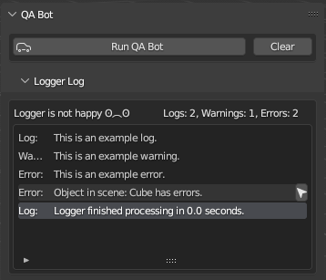

# Blender QA Bot

Custom validation tool used in our production pipeline at Triangle Factory.

 

## Installation instructions

1. Download the latest .zip archive from the [Releases](https://github.com/TriangleFactory/Blender-QABot/releases) page.
2. In Blender, go to __Preferences > Add-On > Install__ and choose the .zip file you downloaded.
3. Look for the "QA Bot" tab in the Object tools.
